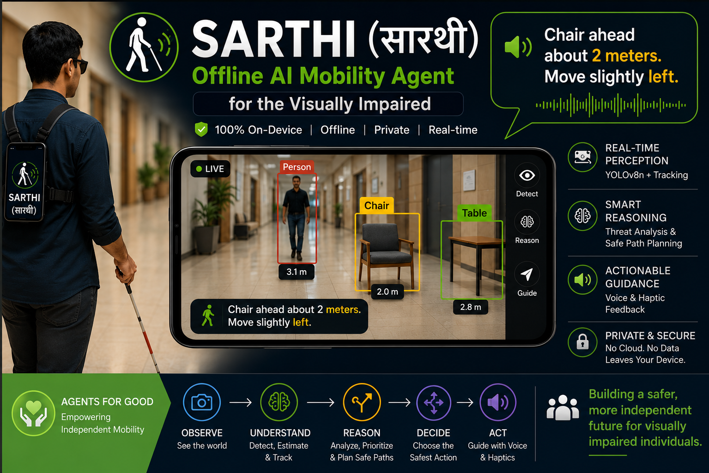
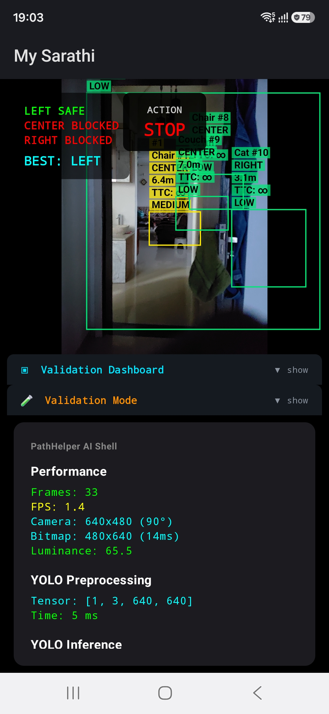
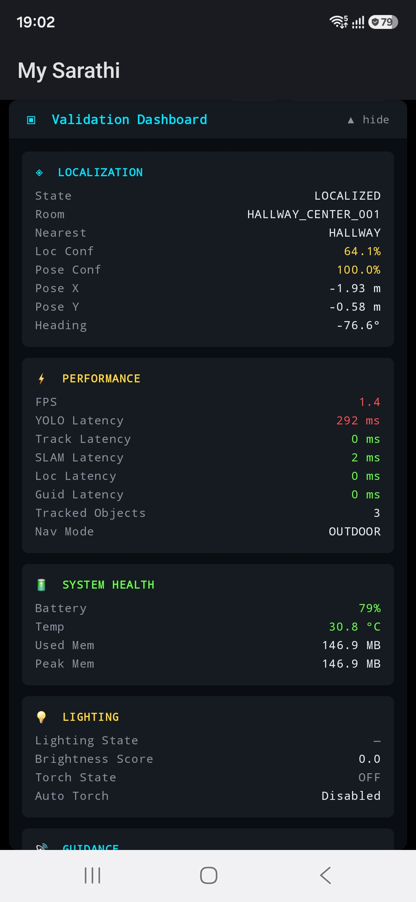
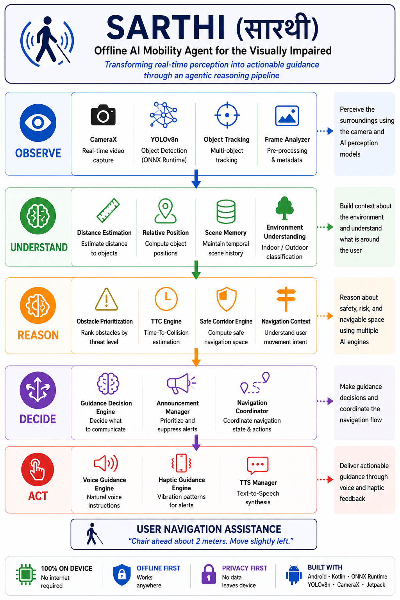

# Sarthi: An Offline AI Mobility Agent for the Visually Impaired



## Transforming real-time perception into actionable guidance through an agentic reasoning pipeline running entirely on an Android device

### Overview

Sarthi is an offline AI mobility agent designed to help visually impaired individuals navigate their surroundings more safely and independently using a standard Android smartphone.

Unlike traditional computer vision applications that stop at object detection, Sarthi transforms perception into actionable guidance through a multi-stage agentic reasoning pipeline. The system continuously observes the environment, identifies obstacles, estimates proximity, prioritizes threats, analyzes safe movement corridors, and generates real-time voice and haptic guidance.

The entire solution runs locally on-device using Android and ONNX Runtime, ensuring low latency, privacy, and operation without internet connectivity.

---

## Problem Statement

Millions of visually impaired individuals rely on white canes, guide dogs, or human assistance for mobility. While these tools remain essential, they provide limited contextual awareness of surrounding obstacles.

Many AI-based solutions depend on cloud processing, specialized hardware, or expensive wearable devices.

Sarthi explores how a standard Android smartphone can function as an intelligent mobility companion capable of:

* Understanding the environment
* Identifying potential hazards
* Reasoning about safe movement
* Delivering actionable guidance

all without requiring cloud connectivity.

---

## Why Sarthi is an AI Agent

Sarthi follows an agentic workflow:

```text
Observe
→ Understand
→ Reason
→ Decide
→ Act
```

### Observe

* CameraX
* Real-time video capture
* Object detection using YOLOv8n

### Understand

* Distance estimation
* Scene memory
* Object persistence tracking

### Reason

* Threat prioritization
* Safe corridor analysis
* Navigation decision making

### Decide

* Guidance Decision Engine

### Act

* Voice guidance
* Haptic feedback
* Context-aware announcements

Instead of merely detecting objects, Sarthi determines which obstacles are most important and generates actionable instructions for the user.

---

## Architecture

```text
CameraX
    ↓
YOLOv8n (ONNX Runtime)
    ↓
Object Tracking
    ↓
Distance Estimation Engine
    ↓
Threat Prioritization Engine
    ↓
Safe Corridor Engine
    ↓
Guidance Decision Engine
    ↓
Voice Guidance + Haptic Feedback
```

---

## Key Features

### Real-Time Obstacle Detection

Detects common indoor and outdoor obstacles using YOLOv8n running entirely on-device.

### Distance-Aware Guidance

Generates context-aware instructions such as:

> Chair ahead about 2 meters. Move slightly left.

### Threat Prioritization

Identifies which obstacle poses the highest risk and prioritizes guidance accordingly.

### Safe Corridor Analysis

Evaluates navigable space and recommends safer movement directions.

### Voice Guidance

Provides spoken instructions to assist users during navigation.

### Haptic Feedback

Supports tactile notifications for improved accessibility.

### Offline First

No internet connection required.

### Privacy Preserving

No camera frames leave the device.

---

## Technology Stack

### Mobile

* Kotlin
* Android SDK
* Jetpack Compose
* CameraX

### AI & Computer Vision

* YOLOv8n
* ONNX Runtime Mobile

### Navigation & Guidance

* Object Tracking
* Distance Estimation
* Threat Prioritization
* Safe Corridor Analysis
* Voice Guidance Engine
* Haptic Guidance Engine

---

## Validation

The system has been validated through:

* Automated unit testing
* Real-device testing
* Indoor navigation scenarios
* Multi-obstacle environments
* Low-light conditions

Key improvements identified through testing include:

* Distance-aware voice guidance
* False positive reduction
* Improved announcement management
* Screen lock prevention during navigation

---

## Project Goals

* Improve obstacle awareness for visually impaired users
* Demonstrate practical Edge AI applications
* Explore agentic decision-making on mobile devices
* Enable affordable and privacy-preserving assistive technology

---

## Future Roadmap

Planned enhancements include:

* Structural awareness
* Door detection
* Corridor understanding
* Indoor localization
* Enhanced scene understanding
* Improved guidance responsiveness
* Semantic navigation capabilities

---

## Installation

## Model Setup

Sarthi uses the YOLOv8n ONNX model for on-device object detection.

To keep the repository lightweight, the model file is not included in source control.

### Download the Model

Export or obtain a YOLOv8n ONNX model and place it at:

```text
app/src/main/assets/models/yolov8n.onnx
```

Expected model path:

```text
Sarathi-ai/
└── app/
    └── src/
        └── main/
            └── assets/
                └── models/
                    └── yolov8n.onnx
```

### Model Requirements

The project was validated using:

* YOLOv8n
* ONNX format
* Input shape: `[1, 3, 640, 640]`
* Output shape: `[1, 84, 8400]`
* Opset: 18

Example export command:

```bash
yolo export model=yolov8n.pt format=onnx imgsz=640 opset=18
```

After placing the model in the assets directory, rebuild the application.


### Prerequisites

* Android Studio Hedgehog or later
* Android SDK 34
* Android device running Android 8.0 (API 26) or above

### Build

```bash
git clone https://github.com/<your-username>/Sarathi-ai.git
cd Sarathi-ai
```

Open the project in Android Studio and run:

```bash
./gradlew assembleDebug
```

Install the generated APK on a supported Android device.

---

## Demo Video

YouTube Demo:

[Pending]

---

## Screenshots

* 
* 
* 

---

## Disclaimer

Sarthi is a research and educational prototype developed as part of the AI Agents: Intensive Vibe Coding Capstone Project.

The application is intended to assist with obstacle awareness and navigation support. It should not be relied upon as the sole mobility aid and is not a replacement for a white cane, guide dog, orientation and mobility training, or professional assistance.

Users should exercise caution and use appropriate mobility aids at all times.

---

## Track

Agents for Good

---

## Acknowledgements

Built using:

* Android
* Jetpack Compose
* CameraX
* ONNX Runtime
* YOLOv8

Developed as part of the AI Agents: Intensive Vibe Coding Capstone Project.

---

## Author
### Naishadh Shah

Engineering Leader | AI Architect | Multi-Agent Systems | Computer Vision | Enterprise Architecture

Areas of Interest

Artificial Intelligence
Multi-Agent Systems
Computer Vision
Generative AI
Edge AI
Enterprise Architecture
Financial Technology
Assistive Technology
